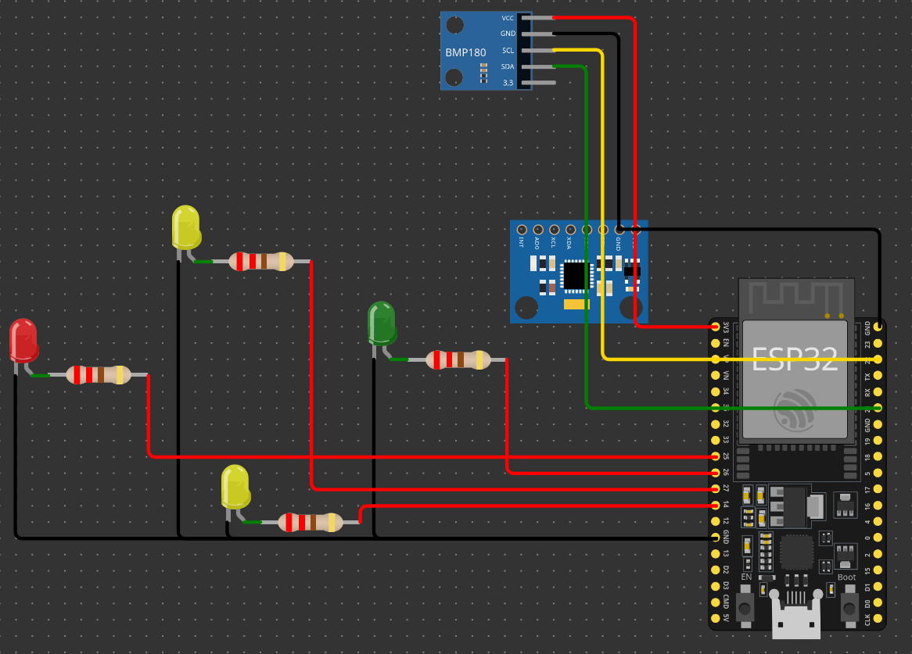

# ESP32 Tabanlı İHA Uçuş Kontrolcüsü (Flight Controller)

Bu proje, ESP32 mikrodenetleyicisi kullanılarak sıfırdan geliştirilmiş, Nesne Yönelimli Programlama (OOP) mimarisine sahip bir İHA uçuş kontrol (stabilizasyon) sistemidir.

Şu anki sürüm (v1.1.0-beta), fiziksel servo motorlara geçilmeden önceki donanım simülasyonu aşamasıdır. Uçağın yatış açılarına (Roll ve Pitch) vermesi gereken dengeleyici tepkiler, PWM sinyalleri ile kontrol edilen LED'ler (sanal servolar) üzerinden test edilmektedir.

## Proje Mimarisi ve Yazılım Kuralları

Bu yazılım, bir mühendislik disipliniyle ve uçuş güvenliği ön planda tutularak tasarlanmıştır:

* **Modüler Yapı (OOP):** Tüm donanımlar (Sensörler ve Aktüatörler) birbirlerinden bağımsız, kapsüllenmiş (encapsulation) C++ sınıfları olarak programlanmıştır.
* **Güvenli Bellek Yönetimi:** Havada sistem kilitlenmelerini (memory leak) önlemek amacıyla dinamik bellek tahsisi (`new`/`delete`) kesinlikle kullanılmamış, tüm nesneler statik olarak oluşturulmuştur.
* **Asenkron Çalışma:** Sensör okumaları ve tepkiler esnasında işlemciyi donduran `delay()` fonksiyonu yerine, `millis()` tabanlı bloklamayan (non-blocking) bir zamanlama algoritması kullanılarak döngü hızı (loop time) stabilize edilmiştir.

## Donanım ve Sensör Bağlantıları

* **Mikrodenetleyici:** ESP-WROOM-32 (38 Pin)
* **Denge ve Yönelim:** MPU6050 (6 Eksenli Jiroskop ve İvmeölçer)
* **İrtifa:** BMP280 (Barometrik Basınç Sensörü - I2C Adresi: 0x76)
* **I2C Haberleşmesi:** SCL (GPIO 22), SDA (GPIO 21)

### Aktüatör (Sanal Servo) Pin Haritası

Uçağın eksenel hareketlerine tepki veren LED'ler şu şekilde konumlandırılmıştır:

| Yön / Hedef | ESP32 Pini | Aksiyon (Dengeleme Tepkisi) |
| :--- | :--- | :--- |
| Sol Kanat (Kırmızı) | GPIO 25 | Sola yatışta (Roll < 0) sol kanadı kaldırmak için orantılı olarak parlar. |
| Sağ Kanat (Yeşil) | GPIO 26 | Sağa yatışta (Roll > 0) sağ kanadı kaldırmak için orantılı olarak parlar. |
| Burun (Sarı) | GPIO 27 | Burun düştüğünde (Pitch < 0) burnu kaldırmak için orantılı olarak parlar. |
| Kuyruk (Sarı) | GPIO 14 | Burun kalktığında (Pitch > 0) kuyruğu kaldırmak için orantılı olarak parlar. |

*(Not: Donanım güvenliği için tüm LED pin çıkışlarında 220Ω / 330Ω koruma dirençleri kullanılmıştır.)*

## Devre Şeması

## Kurulum ve Kullanım

1. Bu projeyi VS Code üzerinde **PlatformIO** eklentisi ile açın.
2. Gerekli donanım kütüphaneleri (`Adafruit MPU6050`, `Adafruit BMP280`, `Adafruit Unified Sensor`) `platformio.ini` dosyasında tanımlıdır ve proje derlenirken otomatik olarak indirilecektir.
3. Cihaz bağlandıktan sonra projeyi derleyip yükleyin (Upload).
4. Sistemi başlattığınızda "Pre-Flight Check" (Uçuş Öncesi Kontrol) koreografisi çalışacak, ardından sistem denge moduna geçecektir. 
5. Serial Monitor (Baud Rate: 115200) üzerinden anlık Roll, Pitch ve İrtifa verilerini gözlemleyebilirsiniz.